# 🩺 Work Item Handler for querying ``Appointment`` FHIR resource attributes

<!-- Badges -->
[](https://www.oracle.com/java/technologies/javase/jdk11-archive-downloads.html) [](https://www.jbpm.org) [](https://www.apache.org/licenses/LICENSE-2.0)

## 📋 Table of Contents
- [Architecture](#-architecture)
- [Development](#-development)
- [Functionality](#-functionality)
- [Verification](#-verification)
- [Proposed Exercise](#-proposed-exercise)

## 🏗️ Architecture

```mermaid
graph TB
    subgraph "jBPM Process Engine"
        A[🔄 Business Process] -->|executes| B[📦 Work Item Handler]
    end
    
    B -->|HTTP Request| C[🌐 FHIR R5 Server]
    
    subgraph "FHIR Server Resources"
        C -->|retrieves| D[📅 Appointment Resource]
        D -->|references| E[👨‍⚕️ Practitioner Resource]
        D -->|references| F[🧑‍🦱 Patient Resource]
    end
    
    B -->|returns| G[📊 Output Data]
    G --> H[👨‍⚕️ Doctor Info]
    G --> I[🧑‍🦱 Patient Info]
    
    style A fill:#e1f5ff
    style B fill:#fff3cd
    style C fill:#d4edda
    style D fill:#f8d7da
    style E fill:#d1ecf1
    style F fill:#d1ecf1
```



**Architecture Description:**
1. 🔄 A jBPM business process executes the custom Work Item Handler
2. 📦 The handler receives an Appointment URL as input
3. 🌐 Makes HTTP requests to the FHIR R5 server
4. 📅 Retrieves the Appointment resource and its references
5. 👨‍⚕️🧑‍🦱 Extracts Practitioner and Patient information
6. 📊 Returns the data to the process

## 💻 Development

This work item handler was generated using the Maven archetype ``org.jbp.jbpm-workitems-archetype`` version ``7.74.1.Final``.

### ⚙️ Requirements

Requires JDK 11 — the ``JAVA_HOME`` environment variable must point to a JDK 11 installation. For example, on Windows PowerShell:

```powershell
$env:JAVA_HOME = 'C:\Program Files\Java\jdk-11.0.4'
```

## ⚡ Functionality

Used as an example work item handler in the course "Healthcare Services Architectures".

It accepts as input the URL of an ``Appointment`` resource on an R5 FHIR server and returns the practitioner (doctor) and the patient for that appointment.

### 📥 Input
- 🔗 **Appointment URL**: URL of the Appointment resource on a FHIR R5 server

### 📤 Output
- 👨‍⚕️ **Practitioner**: Doctor information from the appointment
- 🧑‍🦱 **Patient**: Patient information from the appointment

## ✅ Verification

For testing, an ``Appointment`` resource was created on the public HAPI FHIR test server: ``https://hapi.fhir.org/baseR5/Appointment/773551``. The file named ``Appointment`` in the repository contains a JSON representation of that resource.

### 📁 Resources

The ``resources`` folder also includes several example resource representations in ``.json`` files to help run the exercise, plus a Docker Compose file to start an R5 FHIR server in a Docker container.

### 🐳 Starting the FHIR Server

Running (with admin privileges) the following will start the server defined in the compose file and expose the FHIR endpoint at ``http://localhost:8888/fhir``:

```powershell
docker compose up -d
```

## 📝 Proposed Exercise

1. 🍴 Fork this repository to your GitHub account.
2. 📥 Clone the fork locally.
3. 🚀 Start an R5 FHIR server on your machine using the provided Docker Compose file.
4. 📝 Create the resources referenced by the provided ``Appointment.json`` (located in the tests `resources` folder). That folder contains example JSON representations of the resources to help you; after creating the resources on your server, replace the example JSON files with the actual representations returned by your server.
5. 📅 Create the ``Appointment`` resource (and replace ``Appointment.json`` with the representation obtained from your server).
6. 🔧 Modify the unit test so that it uses your local server instead of the public HAPI FHIR server.
7. 🧪 Run the tests and make any necessary fixes until they pass.
8. 🏷️ Tag a new release called ``EntregaP2`` and push it to your GitHub fork.

---

**Made with ❤️ for Healthcare Services Architectures**

